# Задание 1. Анализ и планирование

### 1. Описание функциональности монолитного приложения

**Управление отоплением:**

- Пользователи могут удаленно включать и выключать систему отопления.  
- Пользователи могут задавать целевую температуру для системы отопления.  
- Система поддерживает автоматическое поддержание заданной температуры (TODO: пока не реализовано, указано в коде).
- Система идентифицирует отопительные системы по уникальному ID.
- Система выполняет логирование всех ключевых действий (включение/выключение, установка температуры).

**Мониторинг температуры:**

- Пользователи могут просматривать текущую температуру для конкретной отопительной системы.
- Система отслеживает текущую температуру в каждой отопительной системе (источник данных текущей температуры не указан, подразумевается).  
- Система предоставляет текущую температуру через API.  
- Система выполняет логирование запросов на получение текущей температуры.  

### 2. Анализ архитектуры монолитного приложения

Основные особенности текущего приложения:

- Язык программирования: Java. Это позволяет использовать богатую экосистему Java и Spring Framework для разработки и поддержки.  
- База данных: PostgreSQL. Надежная и масштабируемая реляционная база данных, подходящая для хранения данных об устройствах, пользователях и истории температур.  
- Архитектура: Монолитная. Все компоненты приложения (веб-интерфейс, API, бизнес-логика, доступ к данным) объединены в один модуль. Это упрощает разработку и развертывание на начальном этапе, но создает проблемы при масштабировании и внесении изменений.  
- Взаимодействие: Синхронное. Запросы обрабатываются последовательно, что может приводить к блокировкам и ухудшению производительности при увеличении нагрузки. Отсутствие асинхронности ограничивает масштабируемость и отзывчивость системы.  
- Масштабируемость: Ограничена. Монолит сложно масштабировать по частям, так как необходимо масштабировать все приложение целиком. Это может быть неэффективно, если только часть функциональности испытывает повышенную нагрузку.  
- Развёртывание: Требует остановки всего приложения. Обновление любой части системы требует переразвертывания всего монолита, что может привести к простою сервиса.  
- Управление устройствами: Централизованное, основано на запросах от сервера к датчику. Отсутствует механизм самостоятельного подключения устройств пользователями. Выезд специалиста для подключения каждого устройства делает систему негибкой и дорогостоящей.  
- Отсутствие Event-Driven архитектуры: Нет использования событий для оповещения об изменениях состояния устройств или других важных событиях.  

Сильные стороны текущего решения:  

- Простота разработки и развертывания: Монолитная архитектура упрощает разработку и развертывание на начальных этапах проекта.  
- Единая кодовая база: Упрощает управление кодом и зависимостями.  
- Централизованное управление: Легче контролировать и мониторить все компоненты приложения.  

### 3. Определение доменов и границы контекстов

В текущей монолитной системе "Тёплый дом" можно выделить следующие домены и границы контекстов, хотя они и неявно реализованы в монолите (AS IS):  
  
- **Домен: Управление Отоплением (Heating Management)**  
  - **Описание**: Основной домен, отвечающий за включение/выключение отопления и установку целевой температуры. Это самая развитая часть текущей системы.  
  - **Границы контекста**:  
    - Включение и выключение отопления по запросу пользователя.  
    - Установка целевой температуры по запросу пользователя.  
    - Сохранение целевой температуры в базе данных.  
    - Отправка команды на устройство (предположительно, через HTTP или другой протокол) для изменения состояния отопления.  
  
- **Домен: Мониторинг температуры (Temperature Monitoring)**  
  - **Описание**: Отвечает за получение и отображение текущей температуры.  
  - **Границы контекста**:  
    - Получение текущей температуры с датчика (предположительно, через HTTP или другой протокол по запросу сервера).  
    - Отображение текущей температуры пользователю.  
    - Сохранение текущей температуры в базе данных.  
  
- **Домен: Управление Устройствами (Device Management)**  
  - **Описание**: В зачаточном состоянии, ограничивается базовыми функциями, необходимыми для работы с отопительными системами.  
  - **Границы контекста**:  
    - Регистрация ID отопительной системы в базе данных.  
    - Установка связи между ID отопительной системы и пользователем (предположительно).  
    - Настройка параметров подключения устройства (предположительно, осуществляется специалистом при установке).  
  
- **Домен: Управление Пользователями (User Management)**  
  - **Описание**: Предположительно, не существует, детали не указаны. Отвечает за аутентификацию и авторизацию пользователей.  
  - **Границы контекста**:  
    - Регистрация пользователей.  
    - Аутентификация пользователей.  
    - Авторизация пользователей (определение прав доступа к отопительным системам).  
  
В при реализации стадии MVP и дальнейшего развития в монолитной системе "Тёплый дом" можно выделить следующие домены и границы контекстов, хотя они и неявно реализованы в монолите (TO BE):  
  
- **Домен: Управление Устройствами (Device Management)**  
  - **Описание**: Отвечает за управление устройствами в умном доме, включая добавление, удаление, обновление конфигурации, мониторинг статуса и предоставление API для взаимодействия с устройствами.  
  - **Границы контекста**:  
    - Подключение новых устройств (Self-service onboarding).  
    - Управление метаданными устройств (типы устройств, производители, модели).  
    - Регистрация устройств в системе.  
    - Предоставление информации об устройствах (статус, характеристики).  
    - Управление безопасностью устройств (авторизация, аутентификация).  
    - Адаптация и трансляция команд для различных протоколов (MQTT, Zigbee, Z-Wave, HTTP).  
  
- **Домен: Мониторинг (Monitoring)**  
  - **Описание**: Отвечает за сбор и обработку данных с датчиков, отображение данных пользователям и предоставление API для доступа к данным.  
  - **Границы контекста**:  
    - Сбор данных с датчиков температуры, влажности, освещенности и других.  
    - Хранение исторических данных.  
    - Визуализация данных на веб-интерфейсе (графики, отчеты).  
    - Анализ данных (например, обнаружение аномалий).  
    - Генерация уведомлений (например, при превышении заданных порогов температуры).  
  
- **Домен: Управление Пользователями (User Management)**  
  - **Описание**: Отвечает за управление пользователями, включая регистрацию, аутентификацию, авторизацию, управление ролями и предоставление API для управления пользователями.  
  - **Границы контекста**:  
    - Регистрация новых пользователей.  
    - Аутентификация пользователей (логин, пароль, двухфакторная аутентификация).  
    - Авторизация пользователей (определение прав доступа к ресурсам).  
    - Управление ролями пользователей (например, администратор, пользователь).  
    - Восстановление пароля.  
  
- **Домен: Уведомления (Notifications)**  
  - **Описание**: Отвечает за отправку уведомлений пользователям о различных событиях, таких как изменение температуры, аварийные ситуации, статусы устройств и т.д.  
  - **Границы контекста**:  
    - Определение типов уведомлений (email, push, SMS).  
    - Формирование и отправка уведомлений.  
    - Управление подписками на уведомления.  
    - Логирование отправленных уведомлений.  

### 4. Проблемы монолитного решения

Текущее монолитное решение "Тёплый дом" при дальнейшем наращивании 
функциональных возможностей столкнётся со следующими ключевыми проблемами:  

- Ограниченная масштабируемость: Трудности при увеличении нагрузки на отдельные компоненты, что приводит к неэффективному использованию ресурсов.  
- Проблемы с развертыванием: Любое изменение требует переразвертывания всего приложения, что увеличивает время и риск ошибок.  
- Технологическая зависимость: Сложности с внедрением новых технологий из-за привязки к текущему стеку.  
- Высокий риск ошибок: Изменения в одной части приложения могут повлиять на другие, что увеличивает вероятность сбоев.  
- Сложность изменений: Большой размер кодовой базы и переплетение логики затрудняют добавление новых функций.  
- Отсутствие гибкости в подключении устройств: Необходимость выезда специалистов для установки устройств тормозит расширение экосистемы.  
- Синхронное взаимодействие: Блокировка запросов снижает отзывчивость системы и ухудшает пользовательский опыт.  
- Управление командой: Расширение команды может вызвать задержки из-за конфликтов при работе над монолитом.  
- Трудности в масштабировании компонентов: Невозможность масштабировать отдельные части системы, требуя масштабирования всего приложения.  
- Риски легаси-кода: Усложняет изменения, увеличивает риски ошибок и затрудняет рефакторинг.  

### 5. Визуализация контекста системы — диаграмма С4

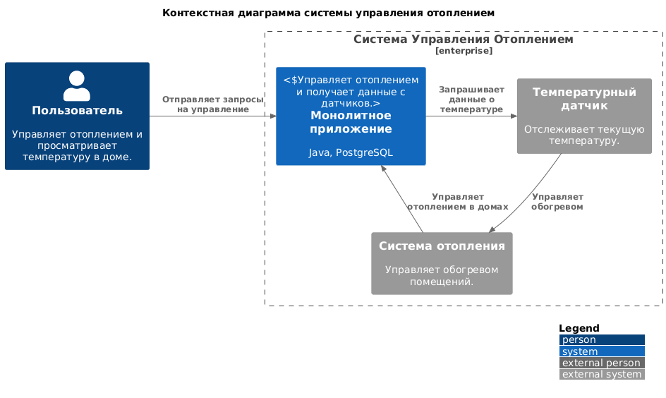
[c4_context_as_is.puml](diagrams/puml/c4_context_as_is.puml)

# Задание 2. Проектирование микросервисной архитектуры

TO BE (итоговое решение, после стадии MVP, описанной в задании, 
с учётом возможности дальнейшего наращивания фцкнциональности).  

## Функциональные требования:

1. **Управление устройствами:**  
   - Добавление и удаление устройств в приложении.  
   - Отображение списка устройств, сгруппированных по комнатам и зонам.  
   - Управление отдельными устройствами: включение/выключение, регулировка параметров (яркость, температура и т.д.).  
   - Поддержка следующих типов устройств:  
     - **Освещение:** "Умные" лампочки, выключатели, диммеры.  
     - **Климат-контроль:** Термостаты, кондиционеры, обогреватели.  
     - **Безопасность:** Датчики движения, датчики открытия/закрытия, камеры видеонаблюдения, замки.  
     - **Развлечения:** "Умные" телевизоры, аудиосистемы.  
     - **Бытовая техника:** Холодильники, стиральные машины, посудомоечные машины.  
     - **Датчики:** Температура, влажность, освещенность, CO2, утечки воды.  
   - Отображение статуса устройств (онлайн/офлайн, уровень заряда батареи и т.д.).  
   - Групповое управление устройствами.  

2. **Автоматизация:**  
   - Создание и редактирование сценариев.  
   - Настройка автоматизаций на основе:  
     - Времени суток.  
     - Местоположения пользователя.  
     - Событий на устройствах (например, срабатывание датчика движения).  
     - ...  
   - Управление расписанием автоматизаций.  

3. **Голосовое управление:**  
   - Управление устройствами и сценариями с помощью Yandex Алиса.  
   - Настройка голосовых команд.  

4. **Уведомления:**  
   - Получение уведомлений о событиях в системе (например, срабатывание сигнализации, низкий заряд батареи устройства).  
   - Настройка типов уведомлений.  

5. **Общий доступ:**  
   - Предоставление доступа к управлению домом другим пользователям (например, членам семьи).  
   - Управление правами доступа.  

6. **Безопасность:**  
   - **Authentication & Authorization:** Использование JWT и ролевой модели доступа.  
   - **HTTPS:** Для безопасной передачи данных между клиентом и сервером.  
   - **Data Encryption:** Шифрование данных при хранении и передаче.  
   - **Двухфакторная аутентификация (2FA).**  

## Нефункциональные требования:

- **Производительность:** Быстрое реагирование на команды управления. Минимальная задержка при отображении статуса устройств.  
- **Надежность:** Стабильная работа системы без сбоев.  
- **Безопасность:** Защита от несанкционированного доступа к системе и данным пользователя.  
- **Масштабируемость:** Поддержка большого количества устройств и пользователей.  
- **Доступность:** Высокая доступность системы (минимизация времени простоя).  
- **Локализуемость:** Поддержка различных языков и региональных настроек.  
- **Удобство использования:** Интуитивно понятный интерфейс.  

## Ключевые архитектурные принципы:

- **Микросервисная архитектура (бэкенд):** Позволяет независимо масштабировать и обновлять различные компоненты системы.  
- **Event-Driven Architecture:** Для асинхронного взаимодействия между компонентами системы (например, для рассылки уведомлений).  
- **RESTful API:** Для взаимодействия между приложением пользователя и бэкендом.  
- **Шифрование данных:** Использование сквозного шифрования для защиты данных пользователя.  
- **Аутентификация и авторизация:** Использование надежных механизмов аутентификации и авторизации для защиты от несанкционированного доступа.  
- **Caching:** Использование кэширования для повышения производительности системы.  

**Диаграмма контейнеров (Containers)**

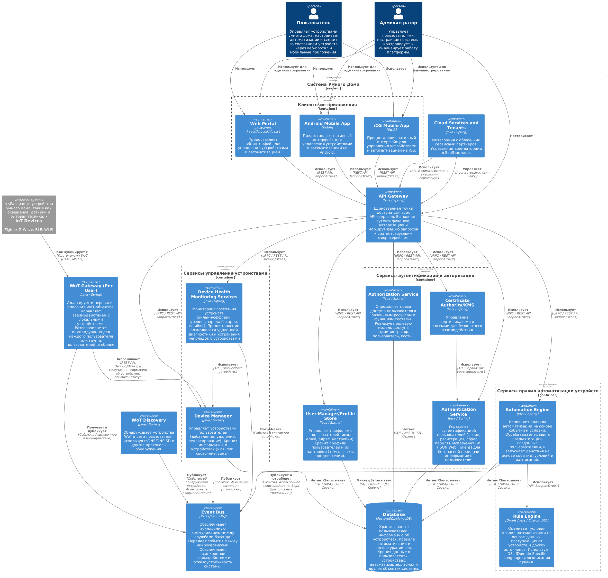
[c4_container.puml](diagrams/puml/c4_container.puml)

## Backend Services (SaaS Cloud):

- Размещаются в облаке (Yandex Cloud) для обеспечения масштабируемости и надежности.
- Состоят из нескольких микросервисов, взаимодействующих через API.

- **a) API Gateway**:
  - Единая точка входа для всех запросов от веб-портала и мобильных приложений.
  - Выполняет аутентификацию, авторизацию и маршрутизацию запросов к соответствующим микросервисам.
  
- **b) Authentication Service**:
  - Управляет аутентификацией пользователей (логин, регистрация, сброс пароля).
  - Использует JWT (JSON Web Tokens) для безопасной передачи информации о пользователе.
  
- **c) Authorization Service**:
  - Определяет права доступа пользователя к различным ресурсам и функциям системы.
  - Реализует ролевую модель доступа (администратор, пользователь, гость).
  
- **d) Device Manager**:
  - Управляет устройствами пользователей (добавление, удаление, редактирование).
  - Хранит информацию о устройствах (имя, тип, состояние, зоны).
  
- **e) Automation Engine**:
  - Обрабатывает правила автоматизации, созданные пользователями.
  - Запускает действия на основе событий, условий и расписаний.
  
- **f) User Manager/Profile Store**:
  - Управляет профилями пользователей (имя, email, адрес, настройки).
  - Хранит профили пользователей и их настройки (темы, языки, предпочтения).
  
- **g) WoT Discovery**:
  - Обнаруживает устройства WoT в сети пользователя.
  - Использует mDNS/DNS-SD и другие протоколы обнаружения.
  
- **h) Rule Engine**:
  - Оценивает условия правил автоматизации на основе данных, поступающих от устройств и других источников.
  - Использует DSL (Domain Specific Language) для описания правил.
  
- **i) WoT Gateway (Per User)**:
  - Разворачивается индивидуально для каждого пользователя (или группы пользователей) в облаке.
  - Адаптирует и транслирует WoT Thing Descriptions (TD) для устройств, связанных с аккаунтом пользователя.
  - Управляет взаимодействием между облачными сервисами и локальными устройствами WoT.
  - Обеспечивает безопасность и контроль доступа к устройствам WoT.
  
- **j) Event Bus (Kafka, RabbitMQ)**:
  - Передает события между микросервисами (например, изменение состояния устройства, срабатывание датчика).
  - Обеспечивает асинхронное взаимодействие и отказоустойчивость системы.
  
- **k) Database**:
  - Хранит данные о пользователях, устройствах, автоматизациях, зонах и других объектах системы.
  - Используется реляционная (PostgreSQL, MySQL) или NoSQL (MongoDB, Cassandra) база данных.

## Поддерживаемые устройства
	
Система предполагает поддержку широкого спектра устройств 
(на стадиях реализации MVP и последующих), 
выступающих в роли отдельных функциональных модулей:  

- **Освещение:**  
  - **Умные лампочки:** Регулировка яркости и цвета, создание световых сцен.  
  - **Умные выключатели:** Управление обычными светильниками через беспроводную связь.  

- **Климат:**  
  - **Умные термостаты:** Автоматическое регулирование температуры в зависимости от времени суток, присутствия людей и других факторов.  
  - **Умные радиаторные краны:** Индивидуальное управление температурой в каждой комнате.  

- **Безопасность:**  
  - **Умные замки:** Удаленное запирание и отпирание дверей, создание временных кодов доступа.  
  - **Камеры видеонаблюдения:** Мониторинг помещений и прилегающей территории, запись видео по движению.  
  - **Датчики движения:** Обнаружение несанкционированного проникновения.  

- **Управление воротами:**  
  - **Автоматические ворота:** Удаленное открытие и закрытие ворот.  

- **Развлечения:**  
  - **Умные колонки:** Воспроизведение музыки и управление умным домом голосом (Yandex Алиса).  
  - **Умные телевизоры:** Управление воспроизведением и интеграция с другими устройствами.  
  
## Ключевые архитектурные шаблоны (паттерны):

- **Kubernetes:** Основа для развертывания и управления микросервисами. Предоставляет возможности автомасштабирования, обнаружения сервисов и балансировки нагрузки.  
- **Auto-Scaling:** Автоматическое масштабирование сервисов в зависимости от нагрузки.  
- **Service Discovery:** Автоматическое обнаружение сервисов, позволяющее им динамически находить друг друга.  
- **Load Balancing:** Распределение трафика между экземплярами сервисов для обеспечения высокой доступности и производительности.  
- **Circuit Breaker:** Защита от каскадных сбоев.  
- **Database per Service:** Каждый микросервис имеет собственную базу данных для обеспечения независимости и гибкости.  
- **Асинхронное Messaging:** Обмен сообщениями через брокер (Event Bus) для слабой связи и отказоустойчивости.  
- **Request/Reply:** Синхронный стиль взаимодействия для сценариев, где требуется немедленный ответ.  
- **Eventual Consistency:** Принцип, который необходимо учитывать при использовании асинхронного обмена сообщениями и распределенных баз данных.  
- **Saga:** Управление сложными распределенными транзакциями.  

## Протоколы интеграции

Протоколы интеграции, обнаружения, обмена сообщениями, управления (альтернативы и конкурирующие стандарты, использующиеся в IoT):  

- **Proprietary APIs:** Большинство производителей IoT-устройств предоставляют свои собственные API для управления устройствами. Эти API часто несовместимы друг с другом, что затрудняет интеграцию устройств от разных производителей.  
- **MQTT:** Pub/Sub протокол обмена сообщениями для маломощных устройств IoT, широко используемый в IoT. MQTT подходит для обмена данными в реальном времени, но не предоставляет стандартизированного способа описания устройств, предлагает простоту в настройках и легкость интеграции.  
- **CoAP:** Легковесный протокол, разработанный специально для IoT. Подобно MQTT, не предоставляет универсального описания устройства, но поддерживает низкий уровень энергопотребления.  
- **mDNS/Bonjour, UPnP:** Протоколы обнаружения устройств в локальной сети.  
- **Zigbee/Z-Wave:** Протоколы беспроводной связи для устройств умного дома, которые обеспечивают высокую степень совместимости между устройствами.  
- **WebSockets:** Обеспечивают двустороннюю связь между клиентом и сервером для мгновенных обновлений.  

## Web of Things (WoT) и Описание Вещи (TD)

**Web of Things (WoT)** – это концепция, основанная на интеграции физических объектов и устройств с веб-технологиями, что позволяет им взаимодействовать через стандартизированные интерфейсы и протоколы. В основе такой интеграции лежат Описание Вещи (Thing Description, TD), которые описывают функциональные возможности объектов и позволяют упрощать их обнаружение и управление.  

Описание Вещи (TD)  

**Описание Вещи (TD)** – это метаданные, которые представляют возможности устройства, его ресурсы и взаимодействия с другими системами. TD обычно включает следующие компоненты:  
- **ID:** Уникальный идентификатор устройства
(который может включать URI).  
- **Группы:** Классификация по типу устройства
(например, AirConditioner, Camera).  
- **Свойства:** Определяют состояния устройства и их значения.   
Значения, которые устройство может предоставить или изменить  
(например, температура, скорость вентилятора).  
	`observable`: `true`указывает на то, что изменения свойства должны вызывать события. 
	`readOnly`: `false`означает, что свойство можно изменять.    
- **Действия:** Описывают операции, которые могут быть выполнены с устройством.  
Методы, которые можно вызвать для управления устройством  
(например, `turnOn`, `adjustTemperature`).  
- **События:** Описывают события, которые генерирует устройство.  
Уведомления об изменениях состояния (например, “дверь открыта”, “движение обнаружено”).  

Дополнительно см.:   
- репозиторий:  
	[Web of Things (WoT) Github](https://github.com/w3c/wot)
- спецификации:  
	[Web of Things (WoT)](https://www.w3.org/WoT/)  
  [Web of Things (WoT) Thing Description 1.1](https://www.w3.org/TR/wot-thing-description/)

## Примеры устройств с описанием (Thing Description, TD)

Кондиционер (Air Conditioner)
```
{
  "@context": "https://www.w3.org/2019/wot/td",
  "id": "urn:dev:wot:air-conditioner-01",
  "title": "Кондиционер",
  "properties": {
    "temperature": {
      "type": "number",
      "unit": "Celsius",
      "description": "Текущая температура"
    },
    "fanSpeed": {
      "type": "number",
      "enum": [1, 2, 3], 
      "description": "Скорость вентилятора"
    }
  },
  "actions": {
    "turnOn": {
      "description": "Включить кондиционер."
    },
    "turnOff": {
      "description": "Выключить кондиционер."
    },
    "setTemperature": {
      "input": {
        "type": "number",
        "unit": "Celsius",
        "description": "Установить температуру"
      }
    }
  }
}
```

Камера (Camera)
```
{
  "@context": "https://www.w3.org/2019/wot/td",
  "id": "urn:dev:wot:camera-01",
  "title": "Камера",
  "properties": {
    "videoStream": {
      "type": "string",
      "description": "URL потока видео"
    },
    "motionDetected": {
      "type": "boolean",
      "description": "Движение обнаружено"
    }
  },
  "actions": {
    "startRecording": {
      "description": "Начать запись видео."
    },
    "stopRecording": {
      "description": "Остановить запись видео."
    }
  },
  "events": {
    "motionDetected": {
      "description": "Событие, генерируемое при обнаружении движения."
    }
  }
}
```

Умный замок (Smart Lock)
```
{
  "@context": "https://www.w3.org/2019/wot/td",
  "id": "urn:dev:wot:smart-lock-01",
  "title": "Умный замок",
  "properties": {
    "locked": {
      "type": "boolean",
      "description": "Статус замка (заперт/отперто)"
    }
  },
  "actions": {
    "lock": {
      "description": "Запереть дверь."
    },
    "unlock": {
      "description": "Отпереть дверь."
    },
    "createTemporaryCode": {
      "input": {
        "type": "string",
        "description": "Создать временный код доступа"
      }
    }
  }
}
```
## Пример сценария работы пользователя

Пример сценария работы пользователя на примере установки свойств Кондиционера (Air Conditioner):  

1. Пользователь открывает приложение на телефоне.  
2. Приложение запрашивает WoT TD кондиционера у Device API.  
3. Приложение отображает доступные свойства (температура, режим, скорость вентилятора) и действия (установить температуру, установить режим).  
4. Пользователь устанавливает температуру на 20°C.  
5. Приложение вызывает setTemperature WoT Action через Device API.  
6. Device API находит кондиционер в Device Repository, извлекает его WoT TD.  
7. Device API проверяет, что действие setTemperature существует в WoT TD.  
8. Device API преобразует температуру (если необходимо) и отправляет команду на WoT Gateway.  
9. WoT Gateway отправляет команду кондиционеру (например, по MQTT).  
10. Кондиционер меняет температуру.  
11. Кондиционер отправляет обновление статуса WoT Gateway.  
12. WoT Gateway публикует событие "temperatureChanged" в Event Bus.  
13. Device Status Updater получает событие из Event Bus и обновляет свойство temperature в Device Repository.  
14. Device Status Updater обновляет характеристику CurrentTemperature в приложении.  
15. Приложение получает уведомление об изменении температуры (через WebSocket или механизм push-уведомлений).  

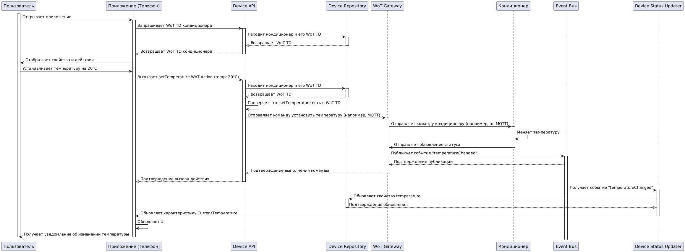
[use_case_device_property_update.puml](diagrams/puml/use_case_device_property_update.puml)

**Диаграмма компонентов (Components)**

Добавьте диаграмму для каждого из выделенных микросервисов.  

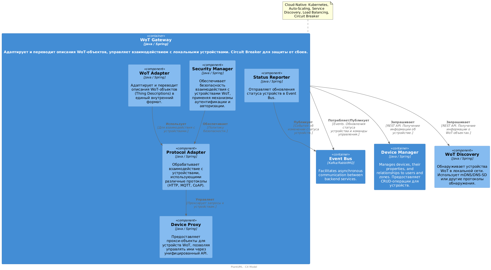
[c4_component_wot_gateway.puml](diagrams/puml/c4_component_wot_gateway.puml)

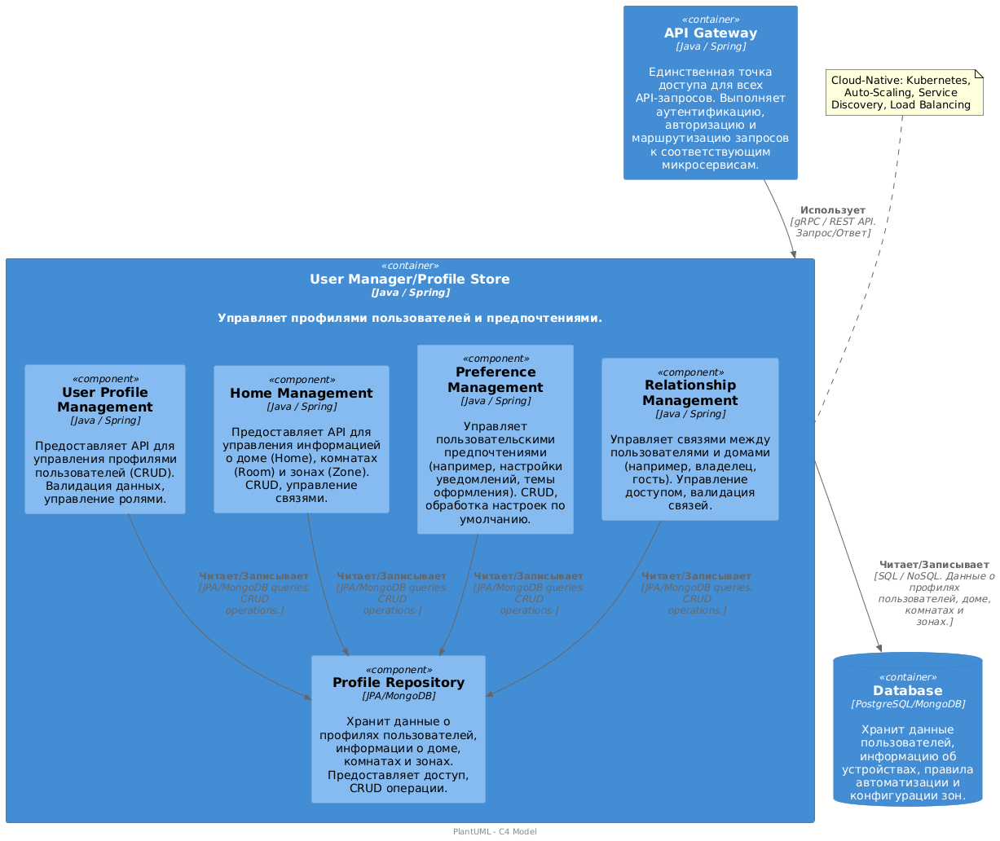
[c4_component_profile_store.puml](diagrams/puml/c4_component_profile_store.puml)

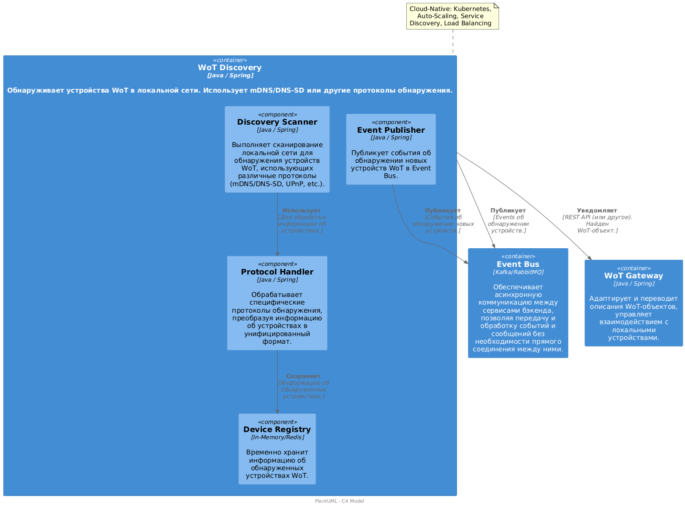
[c4_component_wot_discovery.puml](diagrams/puml/c4_component_wot_discovery.puml)

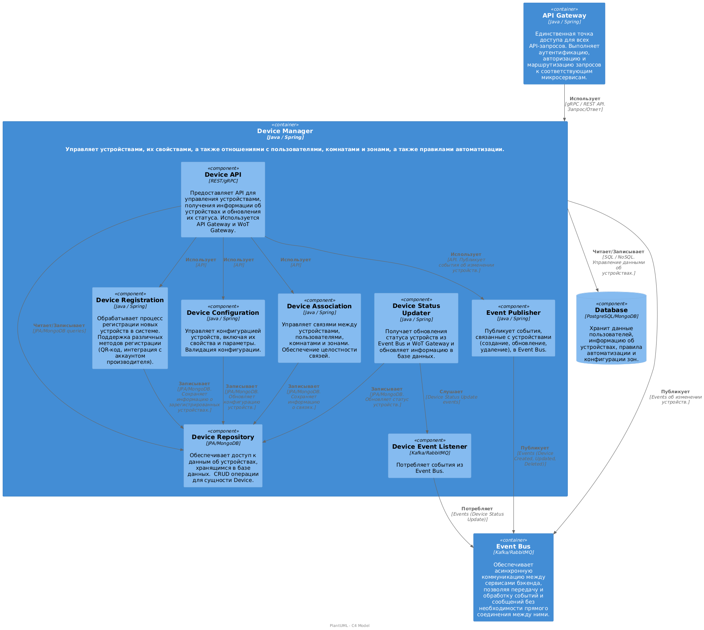
[c4_component_device_manager.puml](diagrams/puml/c4_component_device_manager.puml)

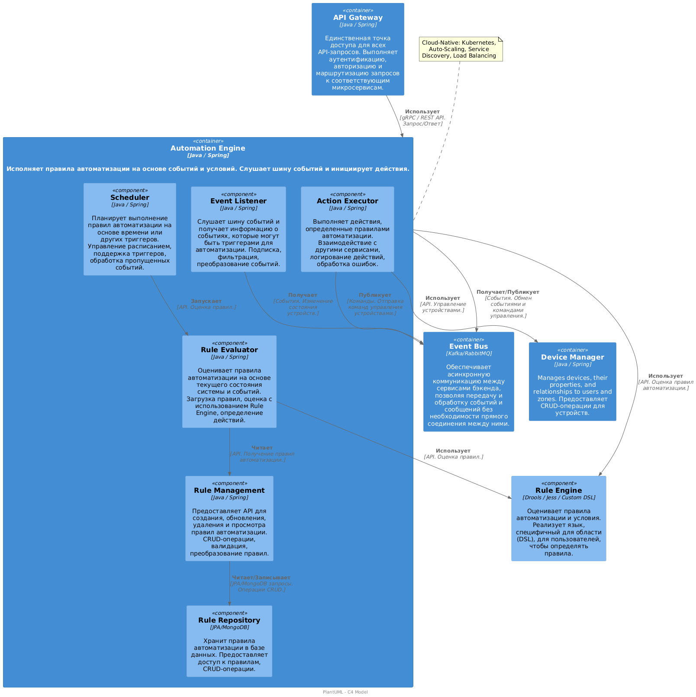
[c4_component_automation_engine.puml](diagrams/puml/c4_component_automation_engine.puml)

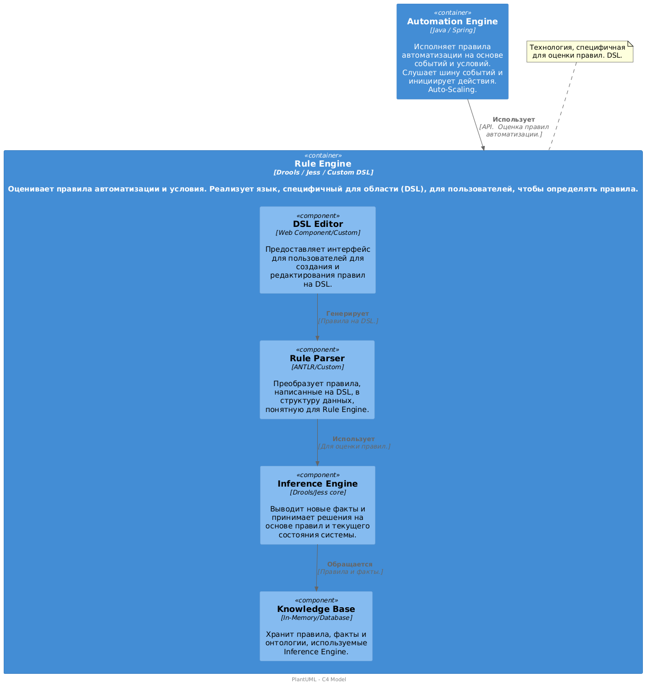
[c4_component_rule_engine.puml](diagrams/puml/c4_component_rule_engine.puml)

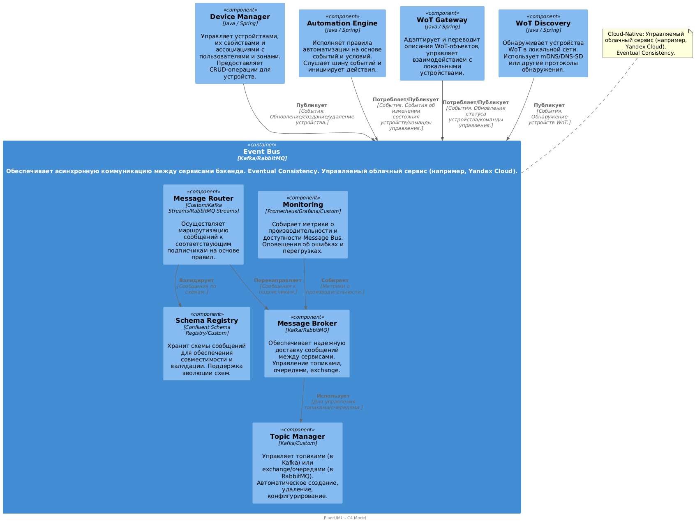
[c4_component_event_bus.puml](diagrams/puml/c4_component_event_bus.puml)

**Диаграммы кода (Code)**

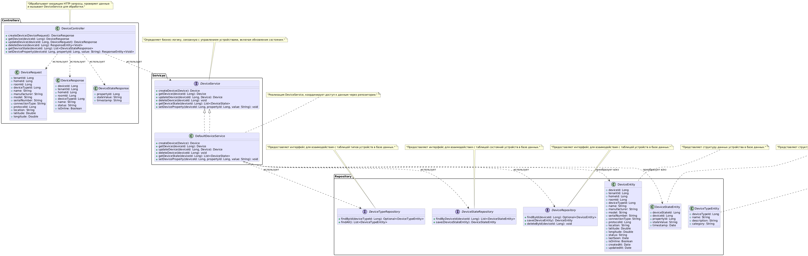
[c4_code_device_api.puml](diagrams/puml/c4_code_device_api.puml)

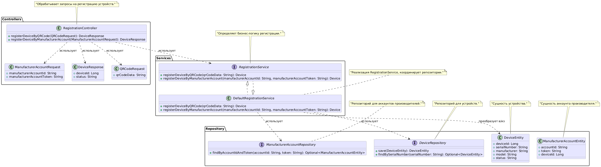
[c4_code_device_registration.puml](diagrams/puml/c4_code_device_registration.puml)

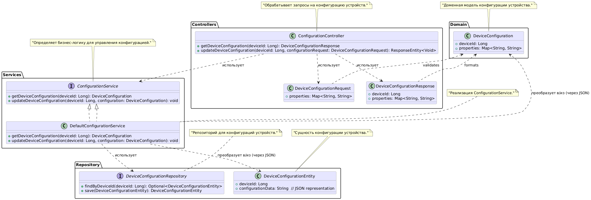
[c4_code_device_configuration.puml](diagrams/puml/c4_code_device_configuration.puml)

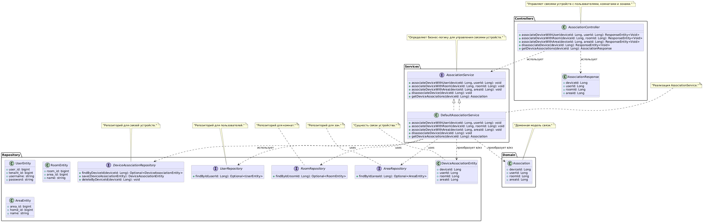
[c4_code_device_association.puml](diagrams/puml/c4_code_device_association.puml)

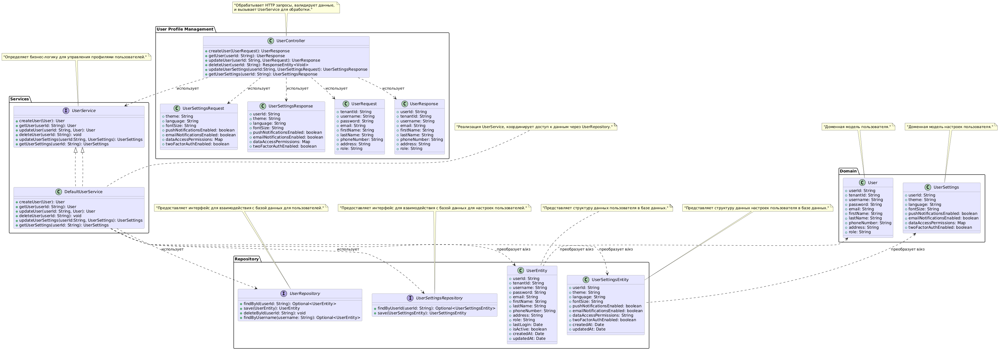
[c4_code_user_profile_management.puml](diagrams/puml/c4_code_user_profile_management.puml)

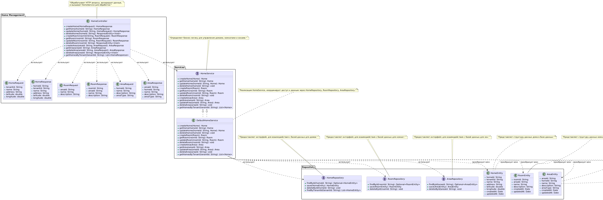
[c4_code_user_home_management.puml](diagrams/puml/c4_code_user_home_management.puml)

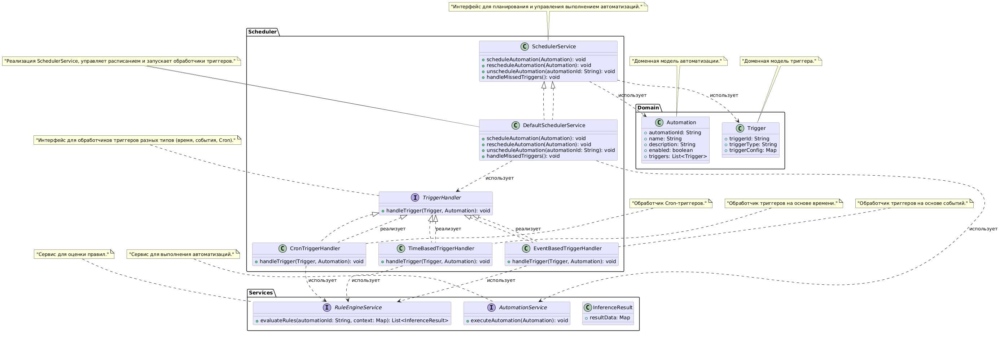
[c4_code_automation_engine_scheduler.puml](diagrams/puml/c4_code_automation_engine_scheduler.puml)

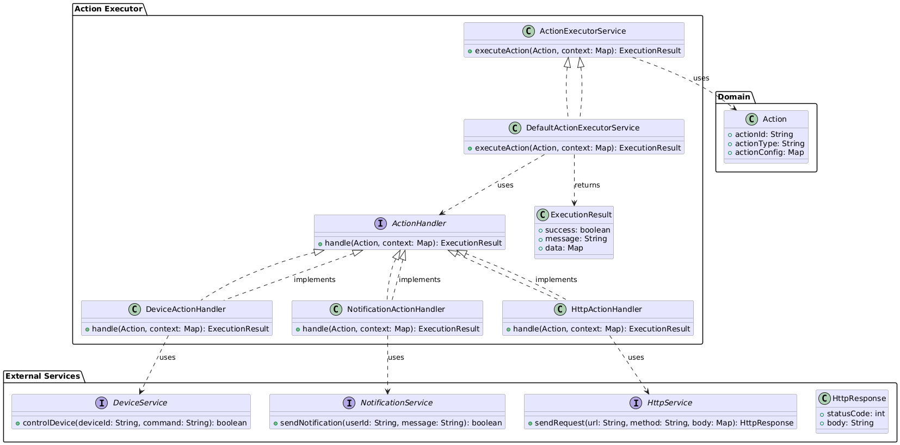
[c4_code_automation_engine_action_executor.puml](diagrams/puml/c4_code_automation_engine_action_executor.puml)

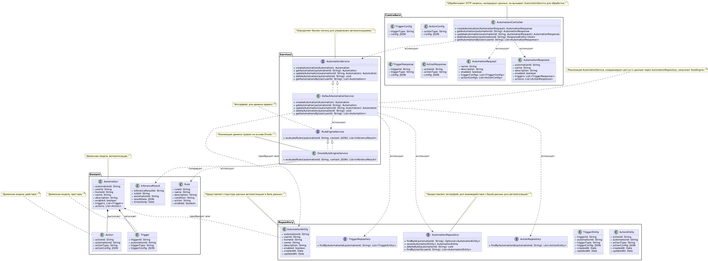
[c4_code_automation_engine_rule_management.puml](diagrams/puml/c4_code_automation_engine_rule_management.puml)

# Задание 3. Разработка ER-диаграммы

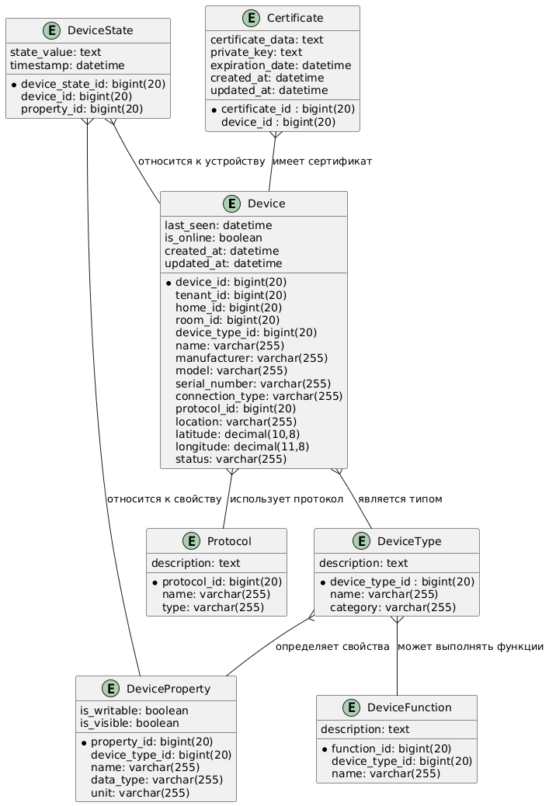

[erd_device_core.puml](diagrams/puml/erd_device_core.puml)

## Описание модели "Device Core"

•  `Device (Устройство)`: Представляет собой физическое или виртуальное устройство в системе (например, лампочка, датчик температуры, виртуальный сервер).  
•  `DeviceType (Тип устройства)`: Определяет класс или категорию устройства, описывая общие характеристики и возможности (например, "Лампочка", "Датчик температуры", "Роутер").  
•  `DeviceProperty (Свойство устройства)`: Описывает характеристики или параметры устройства, такие как имя, тип данных, единицы измерения, возможность записи (например, для лампочки: "Яркость" (тип: число, единицы: проценты, возможность записи: да), "Статус включения" (тип: boolean, возможность записи: да)).  
•  `DeviceFunction (Функция устройства)`: Определяет доступные функции или действия, которые устройство может выполнять (например, для лампочки: "Включить", "Выключить", "Изменить яркость").  
•  `DeviceState (Состояние устройства)`: Записывает текущее состояние устройства, отражая значения его свойств в определенный момент времени.  
•  `Certificate (Сертификат)`: Содержит данные сертификата, используемого для аутентификации и безопасного подключения устройства.  
•  `Protocol (Протокол)`: Описывает протокол связи, используемый устройством (например, MQTT, HTTP, CoAP).  

Атрибуты сущностей:  

Device  
  •  `device_id (bigint(20))`: Уникальный идентификатор устройства.    
  •  `tenant_id (bigint(20))`: Идентификатор арендатора (внешний ключ к таблице Tenant, если используется многоарендность).    
  •  `home_id (bigint(20))`: Идентификатор дома, к которому принадлежит устройство (внешний ключ к таблице Home).    
  •  `room_id (bigint(20))`: Идентификатор комнаты, в которой находится устройство (внешний ключ к таблице Room).    
  •  `device_type_id (bigint(20))`: Идентификатор типа устройства (внешний ключ к таблице DeviceType).    
  •  `name (varchar(255))`: Имя устройства.    
  •  `manufacturer (varchar(255))`: Производитель устройства.    
  •  `model (varchar(255))`: Модель устройства.    
  •  `serial_number (varchar(255))`: Серийный номер устройства.    
  •  `connection_type (varchar(255))`: Тип подключения устройства (например, Wi-Fi, Ethernet, Bluetooth).    
  •  `protocol_id (bigint(20))`: Идентификатор протокола, используемого устройством (внешний ключ к таблице Protocol).    
  •  `location (varchar(255))`: Местоположение устройства (текстовое описание).    
  •  `latitude (decimal(10,8))`: Широта местоположения устройства.    
  •  `longitude (decimal(11,8))`: Долгота местоположения устройства.    
  •  `status (varchar(255))`: Статус устройства (например, "Активно", "Неактивно", "В ожидании").    
  •  `last_seen (datetime)`: Дата и время последнего подключения устройства.    
  •  `is_online (boolean)`: Флаг, указывающий, находится ли устройство в сети.    
  •  `created_at (datetime)`: Дата и время создания записи об устройстве.    
  •  `updated_at (datetime)`: Дата и время последнего обновления записи об устройстве.    
  
DeviceType  
  •  `device_type_id (bigint(20))`: Уникальный идентификатор типа устройства.  
  •  `name (varchar(255))`: Название типа устройства (например, "Лампочка", "Датчик температуры").  
  •  `description (text)`: Описание типа устройства.  
  •  `category (varchar(255))`: Категория типа устройства (например, "Освещение", "Сенсоры", "Безопасность").  
  
DeviceProperty  
  •  `property_id (bigint(20))`: Уникальный идентификатор свойства устройства.  
  •  `device_type_id (bigint(20))`: Идентификатор типа устройства, к которому относится свойство (внешний ключ к таблице DeviceType).  
  •  `name (varchar(255))`: Название свойства (например, "Яркость", "Температура").  
  •  `data_type (varchar(255))`: Тип данных свойства (например, "integer", "decimal", "string", "boolean").  
  •  `unit (varchar(255))`: Единица измерения свойства (например, "%", "°C", "°F").  
  •  `is_writable (boolean)`: Флаг, указывающий, можно ли изменять значение свойства.  
  •  `is_visible (boolean)`: Флаг, указывающий, отображается ли свойство в пользовательском интерфейсе.  
  
DeviceFunction  
  •  `function_id (bigint(20))`: Уникальный идентификатор функции устройства.  
  •  `device_type_id (bigint(20))`: Идентификатор типа устройства, к которому относится функция (внешний ключ к таблице DeviceType).  
  •  `name (varchar(255))`: Название функции (например, "Включить", "Выключить", "Изменить цвет").  
  •  `description (text)`: Описание функции.  
  
DeviceState  
  •  `device_state_id (bigint(20))`: Уникальный идентификатор состояния устройства.  
  •  `device_id (bigint(20))`: Идентификатор устройства, к которому относится состояние (внешний ключ к таблице Device).  
  •  `property_id (bigint(20))`: Идентификатор свойства, значение которого отражает состояние (внешний ключ к таблице DeviceProperty).  
  •  `state_value (text)`: Значение свойства устройства.  
  •  `timestamp (datetime)`: Дата и время записи состояния.  
  
Certificate  
  •  `certificate_id (bigint(20))`: Уникальный идентификатор сертификата.  
  •  `device_id (bigint(20))`: Идентификатор устройства, которому принадлежит сертификат (внешний ключ к таблице Device).  
  •  `certificate_data (text)`: Данные сертификата.  
  •  `private_key (text)`: Приватный ключ сертификата.  
  •  `expiration_date (datetime)`: Дата окончания срока действия сертификата.  
  •  `created_at (datetime)`: Дата и время создания записи о сертификате.  
  •  `updated_at (datetime)`: Дата и время последнего обновления записи о сертификате.  
  
Protocol  
  •  `protocol_id (bigint(20))`: Уникальный идентификатор протокола.  
  •  `name (varchar(255))`: Название протокола (например, "MQTT", "HTTP", "CoAP").  
  •  `description (text)`: Описание протокола.  
  •  `type (varchar(255))`: Тип протокола (например, "Messaging", "Web", "IoT").  
  
Описание связей:  
  
•  `Device }-- DeviceType`: является типом (один-к-одному или один-ко-многим): Одно устройство (Device) имеет один тип устройства (DeviceType). Один тип устройства может иметь несколько устройств.  
•  `DeviceType }-- DeviceProperty`: определяет свойства (один-ко-многим): Один тип устройства (DeviceType) определяет множество свойств (DeviceProperty). Каждое свойство принадлежит только одному типу устройства.  
•  `DeviceType }-- DeviceFunction`: может выполнять функции (один-ко-многим): Один тип устройства (DeviceType) может выполнять множество функций (DeviceFunction). Каждая функция принадлежит только одному типу устройства.  
•  `DeviceState }-- Device`: относится к устройству (один-ко-многим`: Одно устройство (Device) может иметь множество записей состояния (DeviceState). Каждая запись состояния относится только к одному устройству.  
•  `DeviceState }-- DeviceProperty`: относится к свойству (один-ко-многим): Каждое состояние устройства (DeviceState) относится к определенному свойству (DeviceProperty). Одно свойство может иметь множество записей состояний.  
•  `Certificate }-- Device`: имеет сертификат (один-к-одному или один-ко-многим): Одно устройство (Device) может иметь один или несколько сертификатов (Certificate). (В зависимости от требований безопасности). Каждый сертификат принадлежит только одному устройству.  
•  `Device }-- Protocol`: использует протокол (один-к-одному): Одно устройство (Device) использует один протокол (Protocol). Один протокол может использоваться несколькими устройствами.  
  
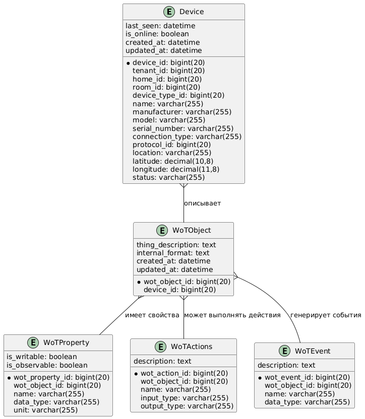  
  
[erd_wot.puml](diagrams/puml/erd_wot.puml)  
  
## Описание модели "WoT Objects"  
  
•  `WoTObject (Объект WoT)`:  Представляет собой описание устройства в соответствии с Web of Things (WoT). Это Thing Description (TD), которое содержит метаданные об устройстве, его свойствах, действиях и событиях.  
•  `WoTProperty (Свойство WoT)`:  Описывает свойства WoTObject, которыми можно управлять или наблюдать. Аналогично DeviceProperty, но в контексте WoT.  
•  `WoTActions (Действия WoT)`:  Описывает действия, которые можно выполнять с WoTObject. Аналогично DeviceFunction, но в контексте WoT.  
•  `WoTEvent (Событие WoT)`:  Описывает события, которые может генерировать WoTObject. Эти события могут сигнализировать об изменении состояния или других важных событиях.  
•  `Device (Устройство)`: См. предыдущее описание.  Используется для связи с WoTObject.  
  
Атрибуты сущностей:  
  
WoTObject  
  •  `wot_object_id (bigint(20))`: Уникальный идентификатор объекта WoT.  
  •  `device_id (bigint(20))`: Идентификатор устройства, к которому относится объект WoT (внешний ключ к таблице Device).  
  •  `thing_description (text)`: Полное описание объекта WoT в формате Thing Description (например, JSON-LD). Содержит информацию о свойствах, действиях, событиях и других метаданных устройства.  
  •  `internal_format (varchar(255))`: Формат, используемый для внутреннего представления объекта WoT (например, JSON, CBOR).  
  •  `created_at (datetime)`: Дата и время создания записи об объекте WoT.  
  •  `updated_at (datetime)`: Дата и время последнего обновления записи об объекте WoT.  
  
WoTProperty  
  •  `wot_property_id (bigint(20))`: Уникальный идентификатор свойства WoT.  
  •  `wot_object_id (bigint(20))`: Идентификатор объекта WoT, к которому относится свойство (внешний ключ к таблице WoTObject).  
  •  `name (varchar(255))`: Название свойства (например, "temperature", "humidity").  
  •  `data_type (varchar(255))`: Тип данных свойства (например, "integer", "number", "string", "boolean").  
  •  `unit (varchar(255))`: Единица измерения свойства (например, "celsius", "fahrenheit", "%").  
  •  `is_writable (boolean)`: Флаг, указывающий, можно ли изменять значение свойства.  
  •  `is_observable (boolean)`: Флаг, указывающий, можно ли подписаться на изменения значения свойства (и получать уведомления).  
  
WoTActions  
  •  `wot_action_id (bigint(20))`: Уникальный идентификатор действия WoT.  
  •  `wot_object_id (bigint(20))`: Идентификатор объекта WoT, к которому относится действие (внешний ключ к таблице WoTObject).  
  •  `name (varchar(255))`: Название действия (например, "reboot", "get_status").  
  •  `description (text)`: Описание действия.  
  •  `input_type (varchar(255))`: Тип входных данных для действия (например, JSON Schema, OpenAPI).  
  •  `output_type (varchar(255))`: Тип выходных данных, возвращаемых действием (например, JSON Schema, OpenAPI).  
  
WoTEvent  
  •  `wot_event_id (bigint(20))`: Уникальный идентификатор события WoT.  
  •  `wot_object_id (bigint(20))`: Идентификатор объекта WoT, к которому относится событие (внешний ключ к таблице WoTObject).  
  •  `name (varchar(255))`: Название события (например, "overheated", "low_battery").  
  •  `description (text)`: Описание события.  
  •  `data_type (varchar(255))`: Тип данных, передаваемых вместе с событием (например, JSON Schema).  
  
Описание связей:  
  
•  `Device }-- WoTObject`: описывает (один-к-одному или один-ко-многим):  Одно устройство (Device) *может* быть описано одним объектом WoT (WoTObject).  Однако, в более сложных случаях, одно устройство может иметь несколько WoTObject (например, разные профили или разные описания для разных интерфейсов).  *Предполагается*, что эта связь существует, если устройство поддерживает WoT.  
•  `WoTObject }-- WoTProperty`: имеет свойства (один-ко-многим):  Один объект WoT (WoTObject) имеет множество свойств (WoTProperty).  Каждое свойство принадлежит только одному объекту WoT.  
•  `WoTObject }-- WoTActions`: может выполнять действия (один-ко-многим):  Один объект WoT (WoTObject) может выполнять множество действий (WoTActions).  Каждое действие принадлежит только одному объекту WoT.  
•  `WoTObject }-- WoTEvent`: генерирует события (один-ко-многим):  Один объект WoT (WoTObject) может генерировать множество событий (WoTEvent).  Каждое событие принадлежит только одному объекту WoT.  
  
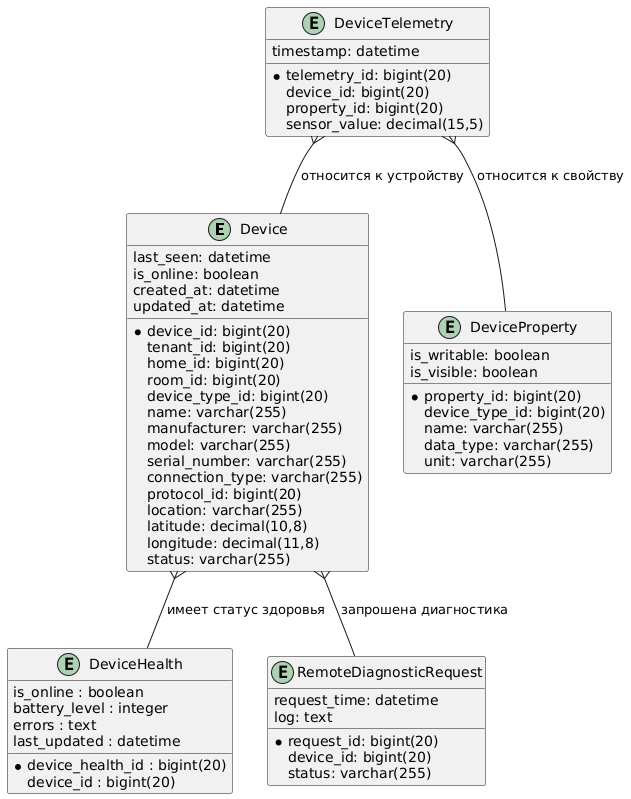  
  
[erd_telemetry.puml](diagrams/puml/erd_telemetry.puml)  
  
## Описание модели "Telemetry, Health, Diagnostics"  
  
•  `DeviceTelemetry (Телеметрия устройства)`: Представляет собой данные телеметрии, полученные от устройства. Обычно включает в себя показания сенсоров, значения параметров и другую информацию, передаваемую устройством для мониторинга его состояния и работы.  
•  `DeviceHealth (Здоровье устройства)`: Содержит информацию о состоянии "здоровья" устройства, включая его онлайн-статус, уровень заряда батареи, ошибки и другие показатели.  
•  `RemoteDiagnosticRequest (Запрос удаленной диагностики)`: Записывает информацию о запросах на удаленную диагностику устройства, включая время запроса, статус и логи.  
•  `Device (Устройство)`: См. предыдущие описания. Используется для связи с данными телеметрии, состоянием здоровья и запросами на диагностику.  
•  `DeviceProperty (Свойство устройства)`: См. предыдущие описания. Используется для указания, какое свойство устройства связано с данными телеметрии.  
  
Атрибуты сущностей:  
  
DeviceTelemetry  
  •  `telemetry_id (bigint(20))`: Уникальный идентификатор записи телеметрии.  
  •  `device_id (bigint(20))`: Идентификатор устройства, от которого получена телеметрия (внешний ключ к таблице Device).  
  •  `property_id (bigint(20))`: Идентификатор свойства устройства, значение которого представлено в телеметрии (внешний ключ к таблице DeviceProperty).  
  •  `sensor_value (decimal(15,5))`: Значение сенсора или параметра, измеренное устройством.  
  •  `timestamp (datetime)`: Дата и время получения данных телеметрии.  
  
DeviceHealth  
  •  `device_health_id (bigint(20))`: Уникальный идентификатор записи о состоянии здоровья устройства.  
  •  `device_id (bigint(20))`: Идентификатор устройства, к которому относится состояние здоровья (внешний ключ к таблице Device).  
  •  `is_online (boolean)`: Флаг, указывающий, находится ли устройство в сети.  
  •  `battery_level (integer)`: Уровень заряда батареи устройства (в процентах или произвольном масштабе).  
  •  `errors (text)`: Список ошибок или предупреждений, связанных с устройством.  
  •  `last_updated (datetime)`: Дата и время последнего обновления информации о состоянии здоровья.  
  
RemoteDiagnosticRequest  
  •  `request_id (bigint(20))`: Уникальный идентификатор запроса на диагностику.  
  •  `device_id (bigint(20))`: Идентификатор устройства, для которого запрошена диагностика (внешний ключ к таблице Device).  
  •  `request_time (datetime)`: Дата и время запроса на диагностику.  
  •  `status (varchar(255))`: Статус запроса на диагностику (например, "В ожидании", "Выполняется", "Завершено", "Ошибка").  
  •  `log (text)`: Журнал выполнения диагностики или результат диагностики.  
  
Описание связей:  
  
•  `DeviceTelemetry }-- Device`: относится к устройству (один-ко-многим): Одно устройство (Device) может генерировать множество записей телеметрии (DeviceTelemetry). Каждая запись телеметрии относится только к одному устройству.  
•  `DeviceTelemetry }-- DeviceProperty`: относится к свойству (один-ко-многим): Запись телеметрии (DeviceTelemetry) относится к определенному свойству (DeviceProperty) устройства. Одно свойство может иметь множество записей телеметрии.  
•  `Device }-- DeviceHealth`: имеет статус здоровья (один-к-одному или один-ко-многим): Одно устройство (Device) имеет один статус здоровья (DeviceHealth). Однако, можно предположить, что со временем может появляться больше одного статуса, поэтому можно считать эту связь "один-ко-многим".  
•  `Device }-- RemoteDiagnosticRequest`: запрошена диагностика (один-ко-многим): Для одного устройства (Device) может быть запрошено несколько диагностических запросов (RemoteDiagnosticRequest). Каждый запрос относится только к одному устройству.  
  
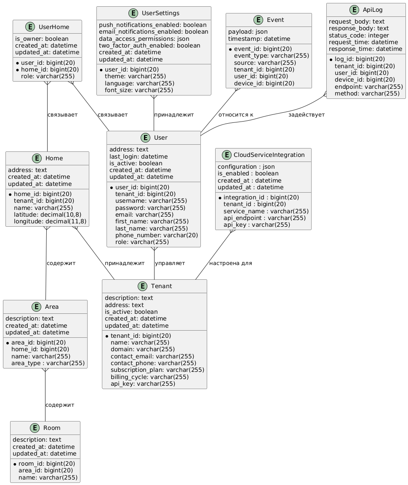  
  
[erd_core.puml](diagrams/puml/erd_core.puml)  
  
## Описание модели данных пользователей и базовых настроек  
  
Данная модель данных описывает структуру базы данных для системы управления умным домом, ориентированной на многопользовательскую (multi-tenant) архитектуру. Она включает в себя сущности, атрибуты и связи, необходимые для управления пользователями, домами, настройками, логами и интеграциями с облачными сервисами.  
  
1. Сущности:  
  
•  `User`: Пользователь системы, имеющий доступ к одному или нескольким домам в рамках определенного тенанта.  
•  `Tenant`: Клиент (арендатор) системы.  Объединяет пользователей, дома и другие ресурсы.  
•  `Home`:  Дом, принадлежащий определенному тенанту.  
•  `UserHome`:  Связь между пользователем и домом, определяющая роль пользователя в доме (например, владелец, член семьи) и права доступа.  
•  `UserSettings`:  Персональные настройки пользователя (тема, язык, уведомления и т.д.).  
•  `Area`: Зона внутри дома (например, этаж, крыло).  
•  `Room`: Комната внутри зоны.  
•  `Event`: Событие, произошедшее в системе (например, включение света, изменение температуры).  
•  `ApiLog`: Журнал запросов к API.  
•  `CloudServiceIntegration`: Информация об интеграции с облачными сервисами (например, Google Home, Amazon Alexa).  
  
Атрибуты сущностей:  
  
User  
	•  `user_id: bigint(20) (PK)`- Уникальный идентификатор пользователя.  
	•  `tenant_id: bigint(20) (FK)`- Идентификатор тенанта, к которому принадлежит пользователь.  
	•  `username: varchar(255)`- Имя пользователя для входа в систему.  
	•  `password: varchar(255)`- Хэш пароля пользователя.  
	•  `email: varchar(255)`- Адрес электронной почты пользователя.  
	•  `first_name: varchar(255)`- Имя пользователя.  
	•  `last_name: varchar(255)`- Фамилия пользователя.  
	•  `phone_number: varchar(20)`- Номер телефона пользователя.  
	•  `address: text`- Адрес пользователя.  
	•  `role: varchar(255)`- Роль пользователя в системе (например, администратор, пользователь).  
	•  `last_login: datetime`- Дата и время последнего входа пользователя в систему.  
	•  `is_active: boolean`- Флаг, указывающий, активен ли аккаунт пользователя.  
	•  `created_at: datetime`- Дата и время создания записи.  
	•  `updated_at: datetime`- Дата и время последнего обновления записи.  
  
Tenant  
	•  `tenant_id: bigint(20) (PK)`- Уникальный идентификатор тенанта.  
	•  `name: varchar(255)`- Название тенанта.  
	•  `description: text`- Описание тенанта.  
	•  `domain: varchar(255)`- Доменное имя, используемое тенантом.  
	•  `contact_email: varchar(255)`- Контактный адрес электронной почты тенанта.  
	•  `contact_phone: varchar(255)`- Контактный номер телефона тенанта.  
	•  `address: text`- Адрес тенанта.  
	•  `subscription_plan: varchar(255)`- Название тарифного плана тенанта.  
	•  `billing_cycle: varchar(255)`- Периодичность оплаты (например, monthly, yearly).  
	•  `api_key: varchar(255)`- Ключ API для доступа к ресурсам тенанта.  
	•  `is_active: boolean`- Флаг, указывающий, активен ли тенант.  
	•  `created_at: datetime`- Дата и время создания записи.  
	•  `updated_at: datetime`- Дата и время последнего обновления записи.  
  
Home  
	•  `home_id: bigint(20) (PK)`- Уникальный идентификатор дома.  
	•  `tenant_id: bigint(20) (FK)`- Идентификатор тенанта, к которому принадлежит дом.  
	•  `name: varchar(255)`- Название дома.  
	•  `address: text`- Адрес дома.  
	•  `latitude: decimal(10,8)`- Широта дома.  
	•  `longitude: decimal(11,8)`- Долгота дома.  
	•  `created_at: datetime`- Дата и время создания записи.  
	•  `updated_at: datetime`- Дата и время последнего обновления записи.  
  
UserHome  
	•  `user_id: bigint(20) (PK, FK)`- Идентификатор пользователя.  
	•  `home_id: bigint(20) (PK, FK)`- Идентификатор дома.  
	•  `role: varchar(255)`- Роль пользователя в доме (например, owner, guest).  
	•  `is_owner: boolean`- Флаг, указывающий, является ли пользователь владельцем дома.  
	•  `created_at: datetime`- Дата и время создания записи.  
	•  `updated_at: datetime`- Дата и время последнего обновления записи.  
  
UserSettings  
	•  `user_id: bigint(20) (PK, FK)`- Идентификатор пользователя.  
	•  `theme: varchar(255)`- Тема интерфейса пользователя.  
	•  `language: varchar(255)`- Язык интерфейса пользователя.  
	•  `font_size: varchar(255)`- Размер шрифта интерфейса пользователя.  
	•  `push_notifications_enabled: boolean`- Флаг, указывающий, включены ли push-уведомления.  
	•  `email_notifications_enabled: boolean`- Флаг, указывающий, включены ли уведомления по электронной почте.  
	•  `data_access_permissions: json`- JSON, содержащий информацию о правах доступа пользователя к данным.  
	•  `two_factor_auth_enabled: boolean`- Флаг, указывающий, включена ли двухфакторная аутентификация.  
	•  `created_at: datetime`- Дата и время создания записи.  
	•  `updated_at: datetime`- Дата и время последнего обновления записи.  
  
Area  
	•  `area_id: bigint(20) (PK)`- Уникальный идентификатор зоны.  
	•  `home_id: bigint(20) (FK)`- Идентификатор дома, к которому принадлежит зона.  
	•  `name: varchar(255)`- Название зоны.  
	•  `description: text`- Описание зоны.  
	•  `area_type : varchar(255)`- Тип зоны (например, этаж, крыло, сад).  
	•  `created_at: datetime`- Дата и время создания записи.  
	•  `updated_at: datetime`- Дата и время последнего обновления записи.  
  
Room  
	•  `room_id: bigint(20) (PK)`- Уникальный идентификатор комнаты.  
	•  `area_id: bigint(20) (FK)`- Идентификатор зоны, к которой принадлежит комната.  
	•  `name: varchar(255)`- Название комнаты.  
	•  `description: text`- Описание комнаты.  
	•  `created_at: datetime`- Дата и время создания записи.  
	•  `updated_at: datetime`- Дата и время последнего обновления записи.  
  
Event  
	•  `event_id: bigint(20) (PK)`- Уникальный идентификатор события.  
	•  `event_type: varchar(255)`- Тип события (например, light_on, temperature_change).  
	•  `payload: json`- JSON, содержащий информацию о событии.  
	•  `source: varchar(255)`- Источник события (например, device, user).  
	•  `tenant_id: bigint(20) (FK)`- Идентификатор тенанта, к которому относится событие.  
	•  `user_id: bigint(20) (FK)`- Идентификатор пользователя, связанного с событием.  
	•  `device_id: bigint(20) (FK)`- Идентификатор устройства, связанного с событием.  
	•  `timestamp: datetime`- Дата и время события.  
  
ApiLog  
	•  `log_id: bigint(20) (PK)`- Уникальный идентификатор записи лога.  
	•  `tenant_id: bigint(20) (FK)`- Идентификатор тенанта.  
	•  `user_id: bigint(20) (FK)`- Идентификатор пользователя.  
	•  `device_id: bigint(20) (FK)`- Идентификатор устройства.  
	•  `endpoint: varchar(255)`- URL запрошенного API.  
	•  `method: varchar(255)`- HTTP метод (например, GET, POST, PUT, DELETE).  
	•  `request_body: text`- Тело запроса.  
	•  `response_body: text`- Тело ответа.  
	•  `status_code: integer`- HTTP статус код.  
	•  `request_time: datetime`- Время отправки запроса.  
	•  `response_time: datetime`- Время получения ответа.  
  
CloudServiceIntegration  
	•  `integration_id : bigint(20) (PK)`- Уникальный идентификатор интеграции.  
	•  `tenant_id : bigint(20) (FK)`- Идентификатор тенанта.  
	•  `service_name : varchar(255)`- Название сервиса (например, Google Home, Amazon Alexa).  
	•  `api_endpoint : varchar(255)`- URL API сервиса.  
	•  `api_key : varchar(255)`- Ключ API для доступа к сервису.  
	•  `configuration : json`- JSON, содержащий информацию о конфигурации интеграции.  
	•  `is_enabled : boolean`- Флаг, указывающий, включена ли интеграция.  
	•  `created_at : datetime`- Дата и время создания записи.  
	•  `updated_at : datetime`- Дата и время последнего обновления записи.  
  
Описание связей:  
  
•  `User - Tenant`: Один ко многим (One-to-Many). Один тенант может иметь несколько пользователей.  
•  `Home - Tenant`: Один ко многим (One-to-Many). Один тенант может иметь несколько домов.  
•  `UserHome - User`: Один ко многим (One-to-Many). Один пользователь может быть связан с несколькими домами.  
•  `UserHome - Home`: Один ко многим (One-to-Many). Один дом может быть связан с несколькими пользователями.  
•  `UserSettings - User`: Один к одному (One-to-One).  Каждый пользователь имеет только один набор настроек.  
•  `Home - Area`: Один ко многим (One-to-Many). Один дом может содержать несколько зон.  
•  `Area - Room`: Один ко многим (One-to-Many). Одна зона может содержать несколько комнат.  
•  `Event - User`:  Один ко многим (One-to-Many).  Много событий может быть связано с одним пользователем.  
•  `ApiLog - User`:  Один ко многим (One-to-Many).  Много записей API может быть связано с одним пользователем.  
•  `CloudServiceIntegration - Tenant`: Один ко многим (One-to-Many). Один тенант может иметь несколько интеграций с облачными сервисами.  
  
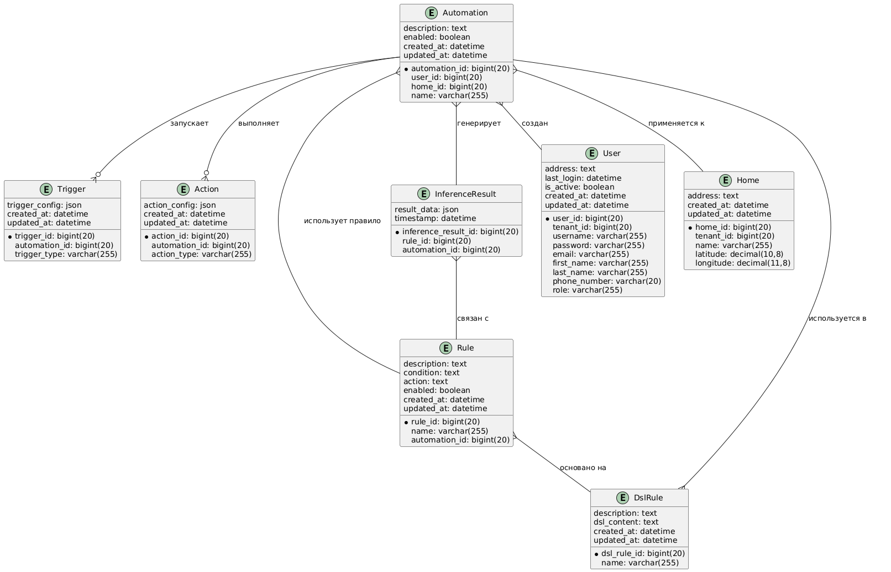  
  
[erd_automation.puml](diagrams/puml/erd_automation.puml)  
  
## Описание модели данных автоматизации  
  
Данная модель данных описывает структуру базы данных для системы автоматизации умного дома. Она включает в себя сущности, атрибуты и связи, необходимые для определения автоматизаций, триггеров, действий, правил и результатов их выполнения. Можно создавать, как простые правила, так и более сложные, определяемые с помощью Domain Specific Language (DSL).  
  
1. Сущности:  
  
•  `Automation`: Автоматизация, представляющая собой набор триггеров, действий и правил, которые срабатывают при выполнении определенных условий.  
•  `Trigger`: Триггер, определяющий условие запуска автоматизации.  
•  `Action`: Действие, которое выполняется при срабатывании автоматизации.  
•  `Rule`: Правило, используемое в автоматизации для определения условий и действий.  
•  `DslRule`: Правило, определенное на специальном языке (DSL), позволяющем задавать более сложные и гибкие условия.  
•  `InferenceResult`: Результат выполнения правила.  
•  `User`: Пользователь системы.  
•  `Home`: Дом, к которому применяется автоматизация.  
  
2. Атрибуты и типы данных:  
  
Automation  
•  `automation_id: bigint(20) (PK)`- Уникальный идентификатор автоматизации.  
•  `user_id: bigint(20) (FK)`- Идентификатор пользователя, создавшего автоматизацию.  
•  `home_id: bigint(20) (FK)`- Идентификатор дома, к которому применяется автоматизация.  
•  `name: varchar(255)`- Название автоматизации.  
•  `description: text`- Описание автоматизации.  
•  `enabled: boolean`- Флаг, указывающий, включена ли автоматизация.  
•  `created_at: datetime`- Дата и время создания записи.  
•  `updated_at: datetime`- Дата и время последнего обновления записи.  
  
Trigger  
•  `trigger_id: bigint(20) (PK)`- Уникальный идентификатор триггера.  
•  `automation_id: bigint(20) (FK)`- Идентификатор автоматизации, к которой принадлежит триггер.  
•  `trigger_type: varchar(255)`- Тип триггера (например, time, event, state_change).  
•  `trigger_config: json`- JSON, содержащий конфигурацию триггера (например, время срабатывания, событие, состояние).  
•  `created_at: datetime`- Дата и время создания записи.  
•  `updated_at: datetime`- Дата и время последнего обновления записи.  
  
Action  
•  `action_id: bigint(20) (PK)`- Уникальный идентификатор действия.  
•  `automation_id: bigint(20) (FK)`- Идентификатор автоматизации, к которой принадлежит действие.  
•  `action_type: varchar(255)`- Тип действия (например, turn_on_light, send_notification).  
•  `action_config: json`- JSON, содержащий конфигурацию действия (например, идентификатор лампы, текст уведомления).  
•  `created_at: datetime`- Дата и время создания записи.  
•  `updated_at: datetime`- Дата и время последнего обновления записи.  
  
Rule:  
  
•  `rule_id: bigint(20) (PK)`- Уникальный идентификатор правила.  
•  `name: varchar(255)`- Название правила.  
•  `description: text`- Описание правила.  
•  `condition: text`- Условие выполнения правила (например, "temperature > 25").  
•  `action: text`- Действие, выполняемое при выполнении условия правила (например, "turn_on_air_conditioner").  
•  `enabled: boolean`- Флаг, указывающий, включено ли правило.  
•  `automation_id: bigint(20) (FK)`- Идентификатор автоматизации, к которой принадлежит правило.  
•  `created_at: datetime`- Дата и время создания записи.  
•  `updated_at: datetime`- Дата и время последнего обновления записи.  
  
DslRule:  
  
•  `dsl_rule_id: bigint(20) (PK)`- Уникальный идентификатор DSL-правила.  
•  `name: varchar(255)`- Название DSL-правила.  
•  `description: text`- Описание DSL-правила.  
•  `dsl_content: text`- Содержание DSL-правила (текст на DSL).  
•  `created_at: datetime`- Дата и время создания записи.  
•  `updated_at: datetime`- Дата и время последнего обновления записи.  
  
InferenceResult:  
  
•  `inference_result_id: bigint(20) (PK)`- Уникальный идентификатор результата выполнения правила.  
•  `rule_id: bigint(20) (FK)`- Идентификатор правила, результат выполнения которого хранится.  
  •  `automation_id: bigint(20) (FK)`- Идентификатор автоматизации, к которой принадлежит правило.  
•  `result_data: json`- JSON, содержащий данные о результате выполнения правила (например, значения переменных).  
•  `timestamp: datetime`- Дата и время выполнения правила.  
  
User:  
  
•  `user_id: bigint(20) (PK)`- Уникальный идентификатор пользователя.  
•  `tenant_id: bigint(20)`- Идентификатор тенанта, к которому принадлежит пользователь. (Включено для согласованности с предыдущей моделью, хотя напрямую не используется в связях этой диаграммы).  
•  `username: varchar(255)`- Имя пользователя для входа в систему.  
•  `password: varchar(255)`- Хэш пароля пользователя.  
•  `email: varchar(255)`- Адрес электронной почты пользователя.  
•  `first_name: varchar(255)`- Имя пользователя.  
•  `last_name: varchar(255)`- Фамилия пользователя.  
•  `phone_number: varchar(20)`- Номер телефона пользователя.  
•  `address: text`- Адрес пользователя.  
•  `role: varchar(255)`- Роль пользователя в системе (например, администратор, пользователь).  
•  `last_login: datetime`- Дата и время последнего входа пользователя в систему.  
•  `is_active: boolean`- Флаг, указывающий, активен ли аккаунт пользователя.  
•  `created_at: datetime`- Дата и время создания записи.  
•  `updated_at: datetime`- Дата и время последнего обновления записи.  
  
Home:  
  
•  `home_id: bigint(20) (PK)`- Уникальный идентификатор дома.  
•  `tenant_id: bigint(20)`- Идентификатор тенанта, к которому принадлежит дом. (Включено для согласованности с предыдущей моделью, хотя напрямую не используется в связях этой диаграммы).  
•  `name: varchar(255)`- Название дома.  
•  `address: text`- Адрес дома.  
•  `latitude: decimal(10,8)`- Широта дома.  
•  `longitude: decimal(11,8)`- Долгота дома.  
•  `created_at: datetime`- Дата и время создания записи.  
•  ``updated_at: datetime``- Дата и время последнего обновления записи.  
  
3. Связи:  
  
•  `Automation - User`: Один ко многим (One-to-Many). Один пользователь может создавать несколько автоматизаций.  
•  `Automation - Home`: Один ко многим (One-to-Many). Одна автоматизация применяется к одному дому.  
•  `Automation - Trigger`: Один ко многим (One-to-Many). Одна автоматизация может иметь несколько триггеров.  
•  `Automation - Action`: Один ко многим (One-to-Many). Одна автоматизация может выполнять несколько действий.  
•  `Automation - Rule`: Один ко многим (One-to-Many). Одна автоматизация может использовать несколько правил.  
•  `Rule - DslRule`: Один к одному (One-to-One) или ноль к одному (Zero-to-One). Правило может быть основано на DSL-правиле (а может и не быть, используя более простой формат условия/действия).  
•  `DslRule - Automation`: Один ко многим (One-to-Many). DSL-правило может использоваться во многих автоматизациях.  
•  `Automation - InferenceResult`: Один ко многим (One-to-Many). Одна автоматизация может генерировать несколько результатов выполнения правил.  
•  `InferenceResult - Rule`: Один к одному (One-to-One). Результат выполнения правила связан с одним конкретным правилом.  
  
Четвёртое задание — дополнительное. Его можно сделать по желанию. Чтобы ревьюер быстрее проверил ваше решение, укажите, сделали вы это задание или нет. Для этого оставьте нужный эмодзи около заголовка задания:  

✅ — вы выполнили задание.  
  
❌ — вы пропустили задание.  
  
# ✅ ❌ Задание 4. Создание и документирование API  
  
### 1. Тип API  
  
Укажите, какой тип API вы будете использовать для взаимодействия микросервисов. Объясните своё решение.  
  
### 2. Документация API  
  
Здесь приложите ссылки на документацию API для микросервисов, которые вы спроектировали в первой части проектной работы. Для документирования используйте Swagger/OpenAPI или AsyncAPI.